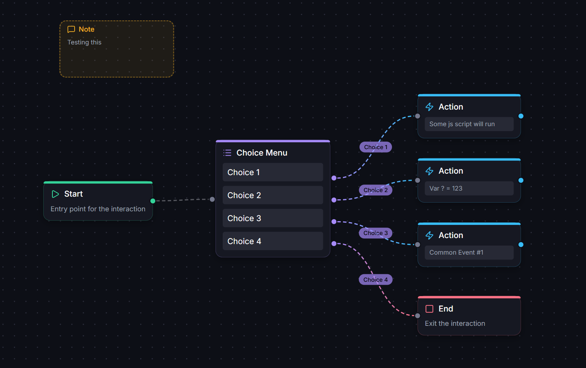
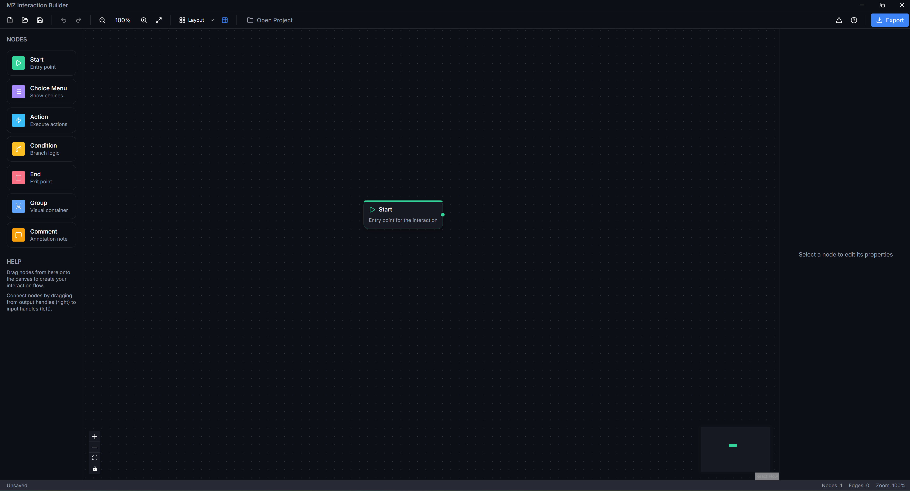
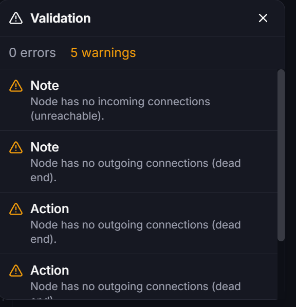

# MZ Interaction Builder

A visual node-graph editor for creating RPG Maker MZ character interactions without coding. Design complex dialogue trees, choice menus, and branching logic visually, then export directly to RPG Maker event commands.

[](https://github.com/Wintersta7e/mz-interaction-builder/actions/workflows/ci.yml)


[](./LICENSE)



## Features

- **Visual Node Graph** - Drag-and-drop interface using React Flow
- **7 Node Types** - Start, Choice Menu, Action, Condition, End, Group, Comment
- **Unlimited Choices** - Menu nodes support any number of choices
- **Hide/Disable Conditions** - Conditionally show or gray out choices
- **Loop Support** - Connect back to earlier nodes for repeating menus
- **Variable Presets** - Built-in presets for Relationship and Time systems
- **Direct Export** - Export to RPG Maker map events with one click
- **Undo/Redo** - Full history support with Ctrl+Z/Ctrl+Y
- **Copy/Paste** - Duplicate nodes with Ctrl+C/Ctrl+V
- **Multi-Select** - Drag rectangle selection, bulk delete, bulk copy/paste
- **Validation** - Real-time warnings for unconnected nodes and dead ends
- **Auto-Save** - Automatically saves every 30 seconds when file path exists
- **Help System** - Press F1 or ? for keyboard shortcuts and node reference
- **Dark Theme** - Blue-tinted palette with Inter/JetBrains Mono fonts
- **Search** - Ctrl+F to find nodes by label or content
- **Path Highlighting** - Alt+Click a node to trace upstream/downstream connections
- **Bookmarks** - Pin important nodes for quick navigation
- **Breadcrumb Trail** - Shows shortest path from Start to selected node
- **Zoom Controls** - Fit All, Fit Selection, Fit to Start hotkeys
- **Context Menu** - Right-click canvas to quickly add nodes
- **Auto-Layout** - Dagre-powered automatic graph layout (LR/TB)
- **Alignment Tools** - Align and distribute selected nodes
- **Snap Guides** - Visual alignment guides when dragging nodes
- **Quick-Add Hotkeys** - Press 1-7 to create nodes at viewport center

## Installation

```bash
cd tools/mz-interaction-builder

# Install dependencies (use --no-bin-links on WSL)
npm install --no-bin-links

# Run in development mode
npm run dev

# Build for production
npm run build
```

## Usage

### Creating an Interaction



1. **Add Nodes** - Drag nodes from the left palette onto the canvas
2. **Connect Nodes** - Drag from output handles (right) to input handles (left)
3. **Edit Properties** - Click a node to edit its properties in the right panel
4. **Save** - Use Ctrl+S or the toolbar button to save your work

### Node Types

| Node | Color | Purpose |
|------|-------|---------|
| **Start** | Green | Entry point - every interaction needs one |
| **Choice Menu** | Purple | Display choices to the player |
| **Action** | Blue | Execute scripts, set variables, call events |
| **Condition** | Amber | Branch based on switches, variables, or scripts |
| **End** | Red | Exit the interaction |
| **Group** | Blue | Visual container for organizing nodes |
| **Comment** | Amber | Annotation note (not exported) |

### Choice Menu Node

- Add unlimited choices with the + button
- Use up/down arrows to reorder choices
- Set cancel behavior (Disallow, Branch, Last Choice)
- Configure window background and position
- **Hide Condition** - Choice doesn't appear when condition is true
- **Disable Condition** - Choice is grayed out when condition is true
- Conditions support Switches, Variables, and Script expressions
- When project is loaded, switch/variable dropdowns populate automatically

### Action Node

Supports multiple action types:
- **Script** - Execute JavaScript code
- **Set Variable** - Change a game variable
- **Set Switch** - Toggle a game switch
- **Common Event** - Call a common event
- **Show Text** - Display a text message
- **Plugin Command** - Call a plugin command

### Condition Node

Branch on:
- **Switch** - Check if ON or OFF
- **Variable** - Compare with operators (=, !=, >, <, >=, <=)
- **Script** - Evaluate JavaScript that returns true/false

## Exporting

The toolbar includes a validation button that checks your graph for common issues before exporting:



### Copy as JSON

Click "Copy to Clipboard" in the Export modal to copy the generated RPG Maker commands. Paste into your event's command list.

### Export to Map

1. Click the Export button in the toolbar
2. Select your RPG Maker MZ project folder
3. Choose the target Map, Event, and Page
4. Click "Export to Map"
5. Reload the map in RPG Maker to see changes

### Conditional Choices

When choices have Hide or Disable conditions, the export uses a dynamic menu system:
- **Hidden choices** are excluded from the menu when their condition is true
- **Disabled choices** appear grayed out (`\C[8]` color code) when their condition is true
- Uses `$gameMessage.setChoices()` for dynamic menu generation
- **Note:** Variable 99 is used as temporary storage for choice routing

## File Format

Interactions are saved as `.mzinteraction` JSON files:

```json
{
  "version": "1.0.0",
  "name": "My Interaction",
  "description": "",
  "nodes": [...],
  "edges": [...],
  "variables": [...],
  "bookmarks": [...]
}
```

## Keyboard Shortcuts

| Shortcut | Action |
|----------|--------|
| Ctrl+N | New file |
| Ctrl+O | Open file |
| Ctrl+S | Save file |
| Ctrl+Z | Undo |
| Ctrl+Y / Ctrl+Shift+Z | Redo |
| Ctrl+C | Copy selected nodes |
| Ctrl+V | Paste nodes |
| Delete / Backspace | Delete selected nodes or edges |
| Ctrl+F | Search nodes |
| Ctrl+0 | Zoom to fit all nodes |
| Ctrl+1 | Zoom to fit selection |
| Home | Zoom to Start node |
| B | Toggle bookmark on selected node |
| Alt+Click | Highlight upstream path |
| Shift+Alt+Click | Highlight downstream path |
| Escape | Clear highlights |
| Ctrl+Shift+L | Auto-layout graph |
| Ctrl+G | Toggle snap-to-grid |
| Alt+L/C/R/T/M/B | Align selected nodes |
| 1-7 | Quick-add node (Start, Menu, Action, Condition, End, Group, Comment) |
| Right-Click | Context menu to add nodes |
| F1 / ? | Show help |
| Scroll Wheel | Zoom in/out |
| Click + Drag | Pan canvas (or rectangle select) |
| Click Edge | Select edge (for deletion) |

## Variable Presets

Built-in presets for common game systems:

**Relationship System**
- Get/Add Affection
- Get/Add Corruption
- Get/Check Stage

**Time System**
- Time Slot, Energy, Day, Weekday
- Action Points, In School flag

## Generated Event Commands

The export generates standard RPG Maker MZ event commands:

| Node Type | Event Codes |
|-----------|-------------|
| Choice Menu | 102 (Show Choices), 402 (When [Choice]), 404 (End) |
| Condition | 111 (Conditional Branch), 411 (Else), 412 (End) |
| Action: Script | 355/655 (Script) |
| Action: Switch | 121 (Control Switches) |
| Action: Variable | 122 (Control Variables) |
| Action: Common Event | 117 (Common Event) |
| Action: Show Text | 101/401 (Show Text) |

Loops are handled with Labels (118) and Jump to Label (119).

## Tech Stack

- **Framework**: Electron 40 + Vite 7
- **UI**: React 19 + TypeScript 5
- **Node Graph**: React Flow (@xyflow/react 12)
- **State**: Zustand 5
- **Layout**: Dagre (auto-layout engine)
- **Styling**: Tailwind CSS 3

## Project Structure

```
src/
├── main/           # Electron main process
│   └── ipc/        # File, dialog, project handlers
├── preload/        # IPC bridge
└── renderer/
    └── src/
        ├── components/   # Canvas, SearchPanel, BookmarkPanel, BreadcrumbTrail, PropertiesPanel, etc.
        ├── edges/        # InteractionEdge (custom color-coded edge component)
        ├── nodes/        # BaseNode + 7 node types
        ├── hooks/        # useDebouncedSync
        ├── stores/       # Zustand: Document, History, UI, Project
        ├── lib/
        │   ├── export/          # RPG Maker command generation
        │   ├── presets/         # Variable presets
        │   ├── graphTraversal.ts # BFS upstream/downstream/shortest path
        │   ├── searchNodes.ts   # Node text extraction and search
        │   └── __tests__/       # Unit tests
        ├── styles/       # globals.css with CSS variables
        └── types/        # TypeScript interfaces
```

## Development

```bash
# Type checking
npm run typecheck

# Linting
npm run lint

# Format code
npm run format

# Build for Windows
npm run build:win

# Build for macOS
npm run build:mac

# Build for Linux
npm run build:linux
```

## License

MIT
